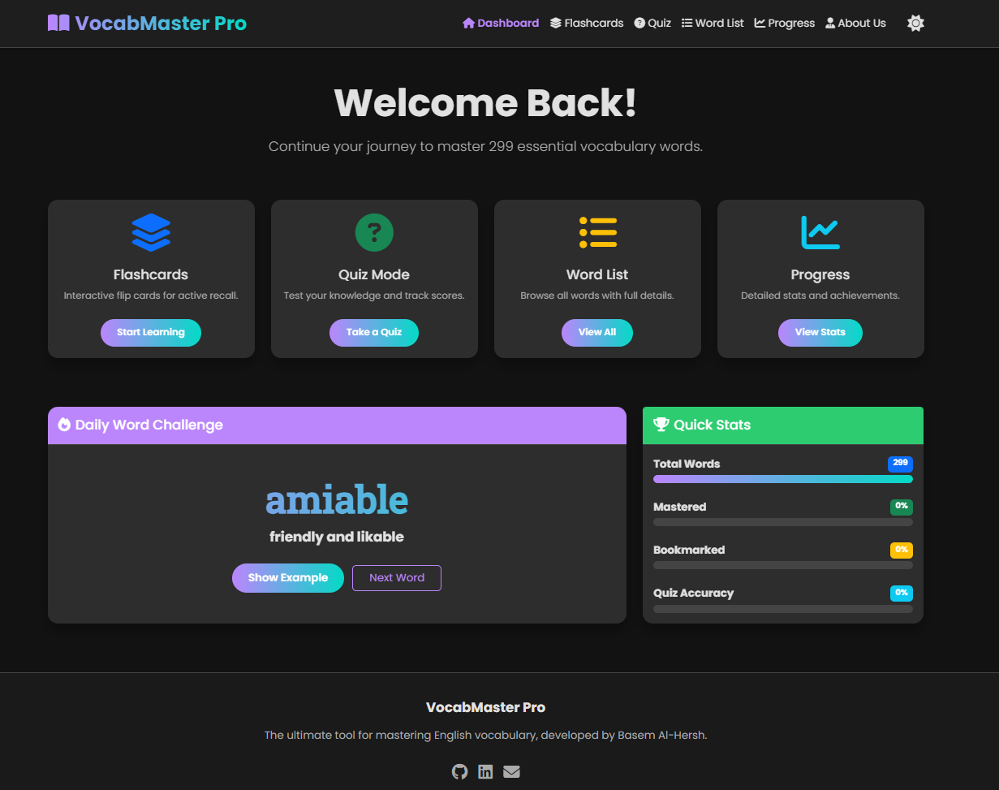
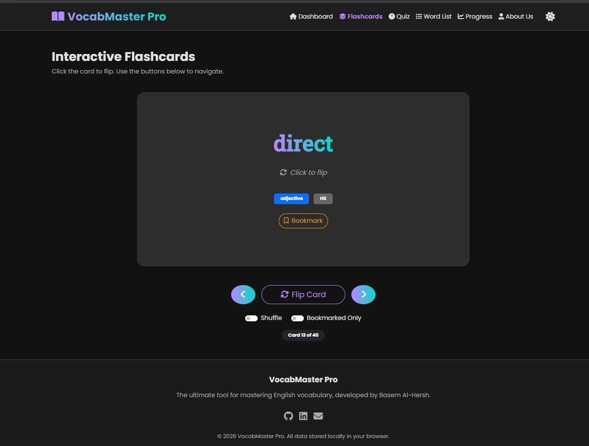
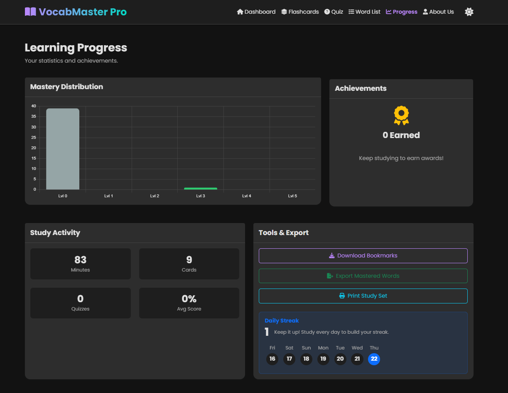
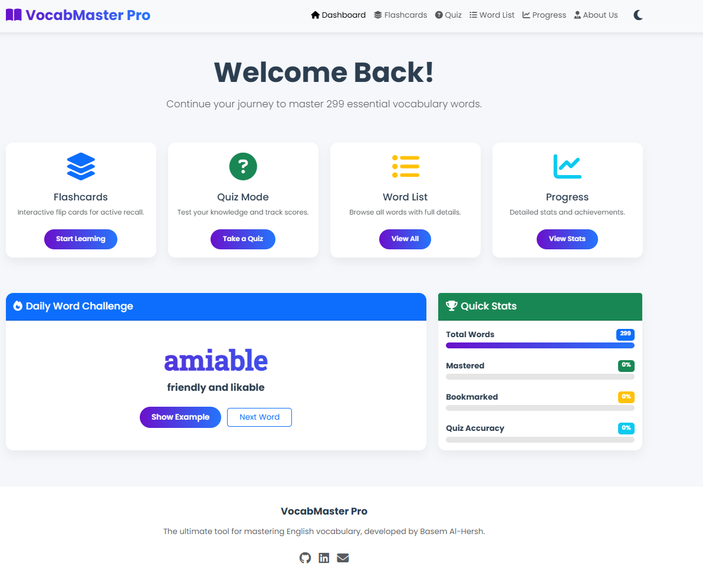

# Vocabulary Master Pro 🚀

<div align="center">


**Master 299 essential vocabulary words with an interactive, beautiful learning platform**

[](https://github.dev/Basem0AlHersh123/vocabulary-master-pro)
[](https://Basem0AlHersh123.github.io/vocabulary-master-pro)

</div>

<br>

<div align="center">
  
</div>

## ✨ Features

<div align="center">
  <table>
    <tr>
      <td width="33%" align="center">
        <h3>🎯 Core Learning</h3>
        
        <p>Interactive flashcards with 3D flip animations</p>
      </td>
      <td width="33%" align="center">
        <h3>📊 Progress Tracking</h3>
        
        <p>Real-time statistics and achievement system</p>
      </td>
      <td width="33%" align="center">
        <h3>🎨 Beautiful Design</h3>
        
        <p>Dark/light theme with smooth animations</p>
      </td>
    </tr>
  </table>
</div>

### 🎯 Core Learning Features
- **Interactive Flashcards** with 3D flip animations
- **Multiple-Choice Quizzes** with scoring system
- **Spaced Repetition** algorithm for optimal learning
- **Mastery Tracking** (5-level system per word)
- **Bookmarking System** for difficult words

### 📊 Progress & Analytics
- **Real-time Statistics Dashboard**
- **Progress Charts** (Chart.js integration)
- **Achievement System** with badges
- **Study Streak Calendar**
- **Performance Analytics**

### 🎨 Design & UX
- **Dark/Light Theme** toggle
- **Responsive Design** (mobile, tablet, desktop)
- **Gradient Backgrounds** & smooth animations
- **Card-based UI** with hover effects
- **Clean Typography** & proper spacing

### 🔧 Technical Features
- **Single HTML File** architecture
- **Local Storage** for data persistence
- **No Backend Required** - works offline
- **Bootstrap 5** for responsive layout
- **Font Awesome** icons
- **Print/Export** functionality

## 🚀 Quick Start

### Option 1: Use Online Demo
Visit the live demo: [Vocabulary Master Pro](https://Basem0AlHersh123.github.io/vocabulary-master-pro)

### Option 2: Run Locally
1. **Clone the repository**
   ```bash
   git clone [https://github.com/Basem0AlHersh123/vocabulary-master-pro.git](https://github.com/Basem0AlHersh123/vocabulary-master-pro.git)
   ```

2. **Open the file**
Simply open `index.html` in your browser - no server needed!
3. **Start learning!**
* Your progress saves automatically
* Works completely offline after first load


## 📖 How to Use

### Dashboard

The dashboard provides an overview of your learning progress, daily challenges, and quick access to all features.

### Flashcards

```javascript
// Interactive 3D flip cards
- Click to flip between word and definition
- Navigate with Previous/Next buttons
- Bookmark difficult words
- Track mastery levels (1-5 stars)

```

### Quiz Mode

* Multiple-choice questions with instant feedback
* Difficulty filtering (HS, College, Advanced)
* Score tracking and performance analytics
* Quiz history and progress tracking

### Word List

* Browse all 299 words alphabetically
* Powerful search and filter functionality
* Expandable detailed view with examples
* Quick bookmark/mastery controls

## 🗂️ Project Structure

```
vocabulary-master-pro/
│
├── index.html              # Single HTML file with all code
├──                  # Images and screenshots
│   ├── dashboard.png
│   ├── profile.jpg
│   └── ...
│
├── Features/
│   ├── 📚 Interactive Flashcards
│   ├── 🎯 Smart Quiz System
│   ├── 📊 Progress Analytics
│   └── 💾 Local Storage
│
└── Tech Stack/
    ├── HTML5 (Semantic markup)
    ├── CSS3 (Custom properties, animations)
    ├── JavaScript ES6+ (Modular architecture)
    ├── Bootstrap 5 (Responsive grid)
    └── Chart.js (Data visualization)

```

## 🎯 Learning Methodology

### Spaced Repetition

The app implements an adaptive learning algorithm that shows words at optimal intervals for memory retention, following the Ebbinghaus forgetting curve.

### Mastery Levels

<div align="center">
<table>
<tr>
<td align="center">⭐


Level 1: New word</td>
<td align="center">⭐⭐


Level 2: Familiar</td>
<td align="center">⭐⭐⭐


Level 3: Understood</td>
<td align="center">⭐⭐⭐⭐


Level 4: Proficient</td>
<td align="center">⭐⭐⭐⭐⭐


Level 5: Mastered</td>
</tr>
</table>
</div>

## 📊 Data Structure

The application manages 299 vocabulary words with comprehensive metadata:

```javascript
{
  word: "motive",
  part_of_speech: "noun",
  definition: "reason (for doing something)",
  example: "She believes the profit motive encourages people...",
  synonyms: "incentive, rationale",
  antonyms: "disincentive",
  difficulty: "HS", // HS, COL, ADV, SP
  notes: "Often used in legal contexts"
}

```

## 👨‍💻 About the Developer

<div align="center">


<h3>Basem Al-Hersh</h3>
<p><strong>IT Student | Ethical Hacking Enthusiast | Python Developer</strong></p>

<p align="center" style="max-width: 600px;">
Highly motivated IT student with a strong foundation in Python development, networking, and system analysis. Passionate about ethical hacking and cybersecurity with a proven ability to rapidly acquire new technical skills.
</p>

<p>
<a href="https://github.com/Basem0AlHersh123"></a>
<a href="https://www.linkedin.com/in/basem-alhersh-769179397"></a>
<a href="mailto:alhrshbasm4@gmail.com"></a>
</p>
</div>

## 🤝 Contributing

Contributions are welcome! Here's how you can help:

1. **Fork** the repository
2. **Create** a feature branch (`git checkout -b feature/AmazingFeature`)
3. **Commit** your changes (`git commit -m 'Add some AmazingFeature'`)
4. **Push** to the branch (`git push origin feature/AmazingFeature`)
5. **Open** a Pull Request

## 📄 License

Distributed under the MIT License. See `LICENSE` for more information.

---

<div align="center">
<h3>Made with ❤️ by Basem Al-Hersh</h3>
<p>If you find this project helpful, please give it a ⭐ on GitHub!</p>
</div>

```

```
